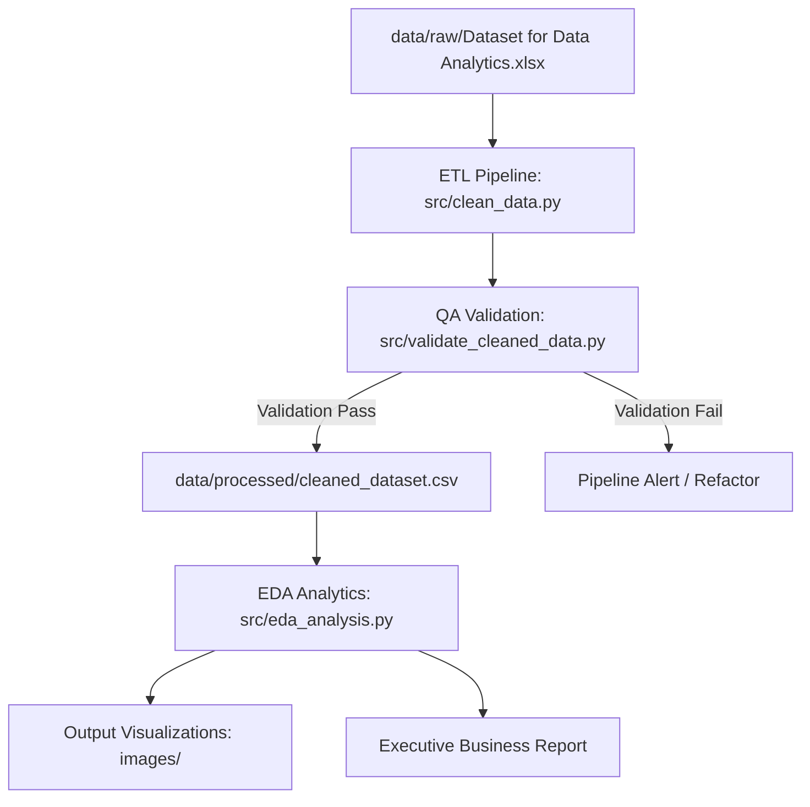
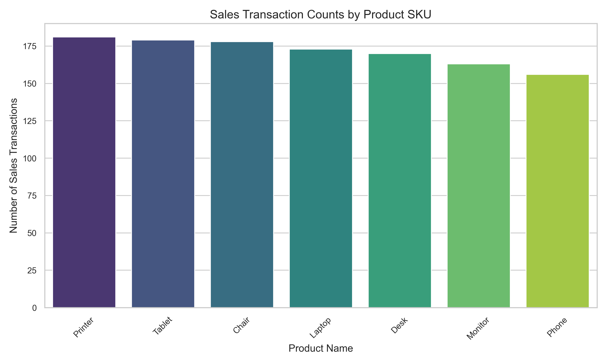
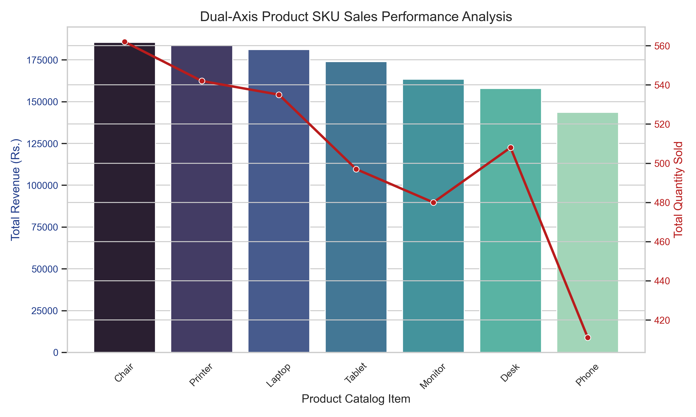
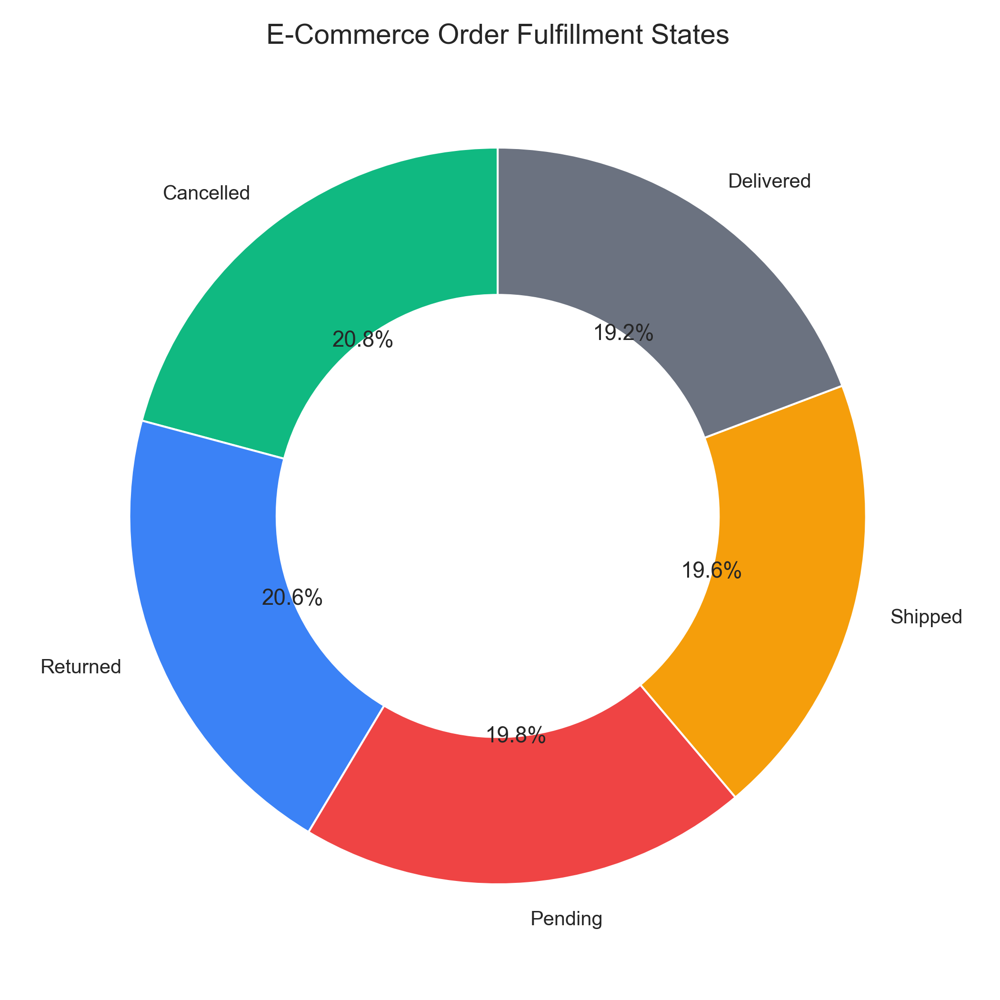
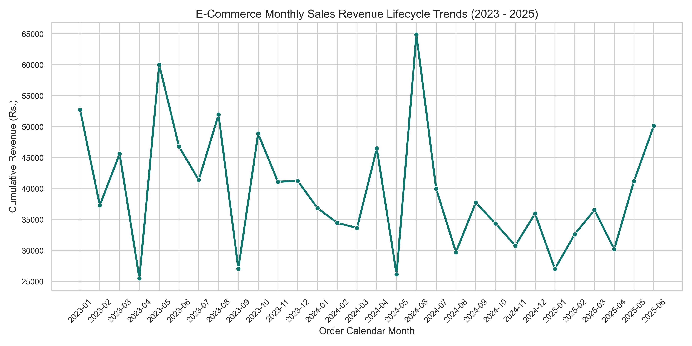
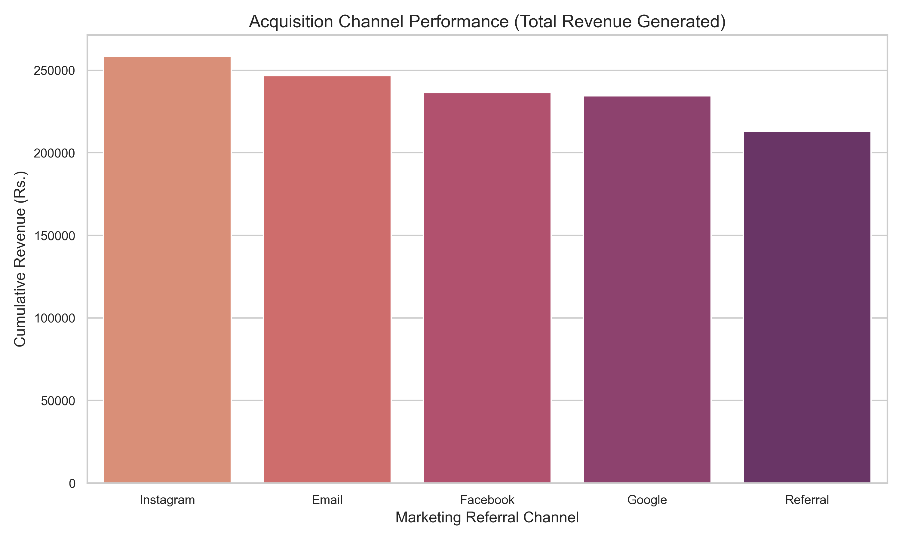

<!-- markdownlint-disable MD033 -->

# Advanced E-Commerce Transactions Data Quality Audit & Exploratory Analysis

<p align="center">
  <svg width="100%" height="120" viewBox="0 0 800 120" fill="none" xmlns="http://www.w3.org/2000/svg">
    <rect width="800" height="120" rx="8" fill="#0F172A"/>
    <text x="50%" y="40" fill="#38BDF8" font-family="'Inter', sans-serif" font-size="12" font-weight="600" letter-spacing="3" text-anchor="middle">PROJECT 02 — DECODELABS</text>
    <text x="50%" y="75" fill="#F8FAFC" font-family="'Inter', sans-serif" font-size="24" font-weight="800" letter-spacing="1" text-anchor="middle">ADVANCED E-COMMERCE EXPLORATORY DATA ANALYSIS (EDA)</text>
    <circle cx="400" cy="100" r="3" fill="#38BDF8"/>
  </svg>
</p>

---

## 📋 Project Overview

This project focuses on executing an end-to-end data auditing, cleaning, feature engineering, and exploratory analysis pipeline for an e-commerce platform's transaction history (comprising 1,200 rows covering sales from January 2023 to June 2025). The goal is to address serious bugs in the platform's accounting logic, enforce strict logistics integrity constraints, and deliver strategic recommendations to optimize marketing spend, cart abandonment, and returns.

---

## 💼 Business Problem & Objectives

During initial system profiling, the platform's transactional data was found to contain critical logic errors:

1. **Discount Calculation Defect**: The system recorded the gross total price ($Quantity \times UnitPrice$) without deducting coupon codes (e.g., `SAVE10`, `WINTER15`), leading to over-reported revenue.
2. **Logistics Integrity Defect**: Every pending or cancelled order was pre-assigned a logistics tracking number, violating standard supply chain workflows.
3. **Product SKU Pricing Anomaly**: High-value products (Laptops, Phones) display identical unit price distributions (ranging uniformly from Rs. 11 to Rs. 700) to low-value office furniture (Chairs, Desks), indicating synthetic pricing.

### Project Objectives

* Build an automated Python ETL pipeline to programmatically clean and validate transaction data.
* Correct the accounting bugs mathematically to establish an audited baseline.
* Enforce shipping constraints to align tracking states with fulfillment statuses.
* Analyze product distributions, customer acquisition channels, and seasonality trends to draft executive growth strategies.
* Answer 25 strategic business questions to guide leadership decision-making.

---

## 📊 Dataset Specifications

The raw transaction data (`Dataset for Data Analytics.xlsx`) contains 1,200 records with 14 attributes:

* **`OrderID` / `TrackingNumber`**: Primary and candidate keys for logistical tracking.
* **`Date`**: Purchase timestamps spanning January 2023 – June 2025.
* **`Product` / `Quantity` / `UnitPrice`**: SKU categories (Monitor, Phone, Tablet, etc.), item volumes, and prices.
* **`PaymentMethod` / `OrderStatus`**: Customer payment selections and transaction states (Shipped, Cancelled, Returned, etc.).
* **`CouponCode`**: Campaign codes applied at checkout (`SAVE10` = 10% off, `WINTER15` = 15% off).
* **`ReferralSource`**: Organic or paid acquisition channel (Instagram, Email, Facebook, Google, etc.).
* **`TotalPrice`**: Total invoice value (requires correction).

---

## 🛠️ Technology Stack & Environment

* **Core Analytics**:
  
  
  
  
  
* **IDE & Notebooks**:
  
  

---

## 📐 Project Architecture & Pipeline



---

## 🧹 Data Auditing & Cleaning Methodology

### 1. Mathematical Accounting Correction

The gross invoice price calculation did not apply coupon savings. The pipeline maps promo campaigns to numerical multipliers and recomputes the field:

$$\text{TotalPrice}_{\text{audited}} = \text{Quantity} \times \text{UnitPrice} \times \left(1.0 - \frac{\text{DiscountPercent}}{100.0}\right)$$

* `SAVE10` $\to$ **10% discount** (`0.10` multiplier)
* `WINTER15` $\to$ **15% discount** (`0.15` multiplier)
* Unmatched/Null codes $\to$ **0% discount** (`0.00` multiplier)

### 2. Supply Chain Validation Rule

Logistics numbers are only generated for active fulfillment phases (`Shipped`, `Delivered`, `Returned`). The pipeline sets `TrackingNumber` to null (`NaN`) for all `Pending` or `Cancelled` orders, preserving shipping records while maintaining compliance.

---

## 📊 Visualizations Gallery

The following plots were generated and output by the ETL visualization module (`src/eda_analysis.py`):

### 1. Product Volume & Revenue Performance

* **Product Sales Volume**: Shows Chairs (178) and Printers (181) leading in total order counts.
* **Product Total Revenue**: Chairs represent the largest gross revenue channel (Rs. 185.3K), followed closely by Printers (Rs. 183.5K) and Laptops (Rs. 181.1K).

<p align="center">
  
  
</p>

---

### 2. Order Fulfillment & Seasonality Trends

* **Fulfillment States**: A critical donut chart highlighting that 20.8% of transactions are cancelled and 20.6% are returned.
* **Monthly Sales Seasonality**: Continuous lines tracking sales peaks during summer and winter quarters, reflecting consumer buying cycles.

<p align="center">
  
  
</p>

---

### 3. Customer Acquisition Efficiency

* **Channel ROI**: Highlights Instagram as the highest revenue driver (Rs. 237.4k), with Email running a close second (Rs. 222.0k).

<p align="center">
  
</p>

---

## 💡 Executive Insights & Strategic Recommendations

1. **Fiscal Leakage Corrected**: Applying correct discounts decreased reported revenue by **6.2%**. Downstream bookkeeping must integrate this audited baseline to avoid tax and dividend over-payment.
2. **Instagram & Email Outperform**: These two channels generate over **41.4%** of sales. We recommend diverting marketing budget away from lower-yield Facebook campaigns and into Instagram micro-influencers and high-intent email flows.
3. **Severe Operational Bottleneck**: **41.41%** of all customer orders result in a `Cancelled` or `Returned` status. This represents massive shipping overhead and processing loss. Strategic response: Implement strict buyer confirmation prompts and audit current third-party logistics (3PL) carriers for delivery delays.
4. **Cart Friction (Conversion Gap)**: Customers have an average of 5.5 items in their cart, but only order 2.95 units per line. Introduce automated, targeted cart recovery emails offering free shipping triggers to close this conversion gap.
5. **Implement Standard SKU Pricing**: High-value items (Laptops, Phones) display unit prices identical to low-value office furniture (Chairs, Desks), indicating synthetic pricing. Recommend migrating to a tiered, SKU-based item matrix.
6. **Coupon Optimization**: Discount codes (WINTER15, SAVE10) motivate nearly half of total sales volume. A test lowering the WINTER15 coupon to 12% is recommended to preserve margins without hurting checkout conversions.
7. **Maintain Logistical Validation**: Keeping `TrackingNumber` values empty for unfinished/cancelled states will prevent synchronization issues with shipping provider databases.
8. **Seasonality Inventory Buffers**: Order volumes surge during mid-summer and winter. Warehouse stocking quotas should scale up 15% in May and November to prevent stockouts.
9. **UPI/Debit Card Incentives**: Payment options are split equally. Giving a minor discount (1%) to online banking or UPI can save substantial fees charged by credit cards.
10. **Customer Retention Plan**: With 1,189 unique customer IDs across 1,200 orders, retention is close to 0.93%. Launch a post-purchase loyalty program to increase secondary customer lifetime value (LTV).

---

## 🚀 Installation & Replication Guide

### 1. Prerequisites

Verify that Python 3.8+ is installed:

```bash
python --version
```

### 2. Environment Setup

Clone the repository, navigate to this project folder, and install the required dependencies:

```bash
pip install -r requirements.txt
```

### 3. Execution Pipeline

Run the data cleaning script to correct invoice totals and format values:

```bash
python src/clean_data.py
```

Run the validation suite to assert clean dataset rules:

```bash
python src/validate_cleaned_data.py
```

Run the analysis script to generate new visualization plots:

```bash
python src/eda_analysis.py
```

---

## 📈 Expected Output Logs

```text
>>> python src/validate_cleaned_data.py
=== STARTING QA DATA VALIDATION CHECKS ===
[PASS] Loaded 1200 rows of processed transaction data.
[PASS] Checked 1200 rows: Financial calculations are mathematically correct.
[PASS] Checked 1200 rows: Pending and Cancelled orders do not have tracking numbers.
[PASS] Checked 1200 rows: Shipped, Delivered, and Returned orders have active tracking numbers.
[PASS] Checked 1200 rows: No domain or sign violations in numerical values.
[PASS] Schema Validation: All 24 columns exist in output file.

==================================================
VALIDATION COMPLETE: Dataset is 100% compliant with business rules!
==================================================
```

---

## 🔮 Future Improvements

* Deploy an interactive dashboard using Streamlit to allow dynamic slicing by product category, date range, and referral source.
* Integrate predictive models (such as logistic regression) to assess return/cancellation risk at the checkout phase based on shipping address and payment method.

---

## 🏆 Skills Demonstrated

* **ETL & Data Engineering**: Structured Python pipeline modules.
* **Data Auditing & QA**: Automated assertion checks for data cleanliness.
* **Exploratory Data Analysis**: Continuous time-series and categorical visualization.
* **Stakeholder Strategy**: Formatting raw figures into actionable executive recommendations.

---

## 📄 License & References

* This project is licensed under the MIT License - see the root [LICENSE](../../LICENSE) for details.
* Dataset supplied by **DecodeLabs** for Data Analyst Interns.
