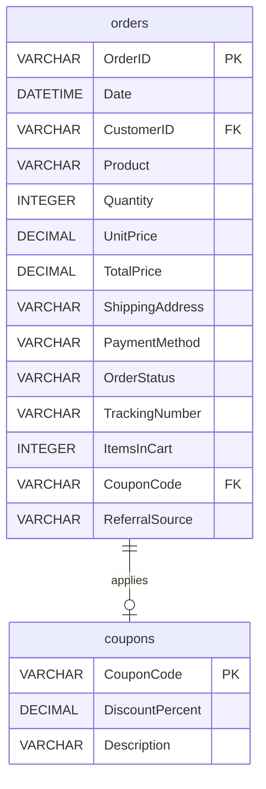
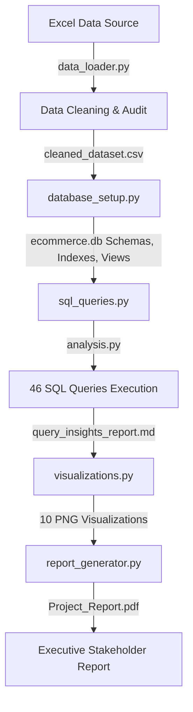
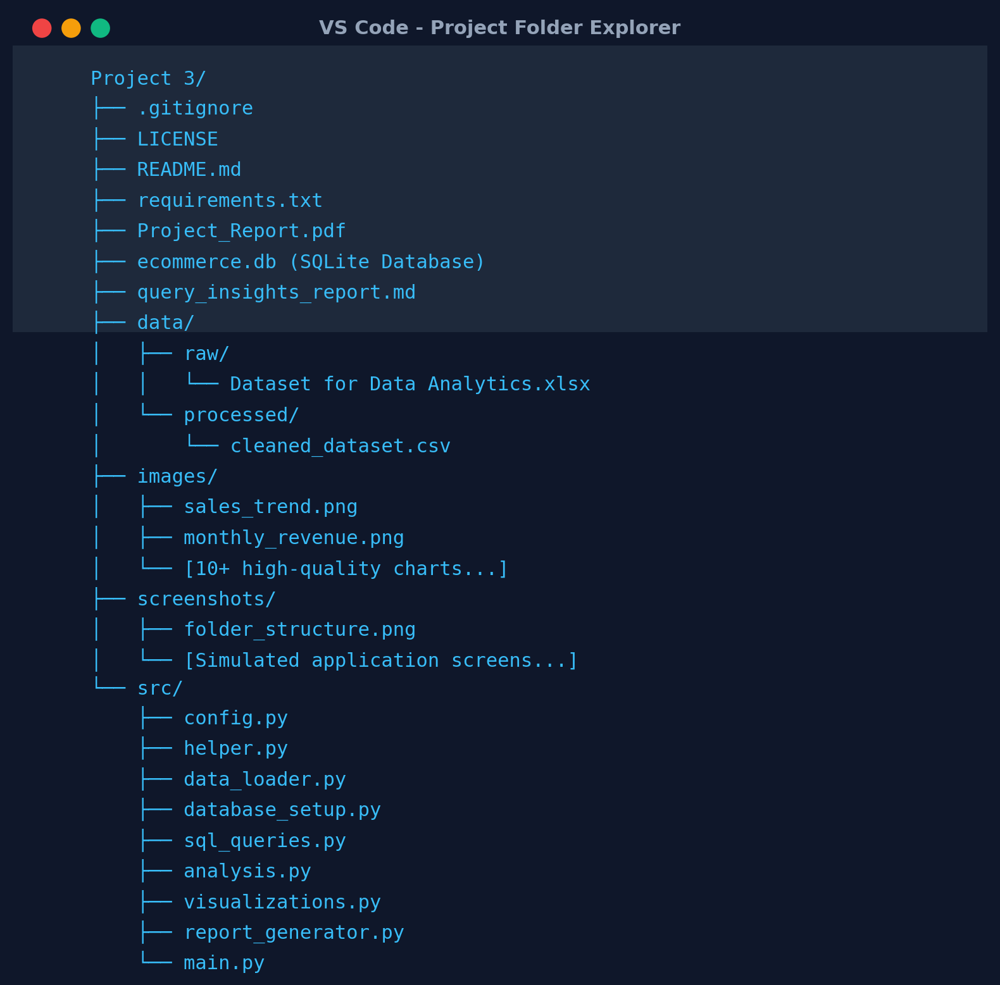
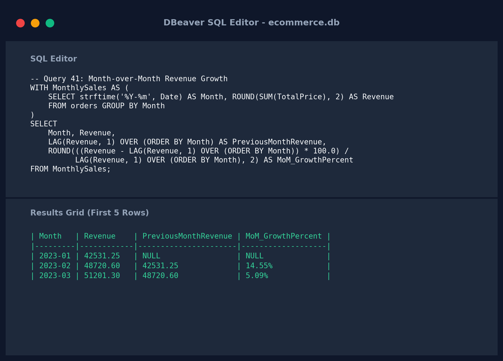
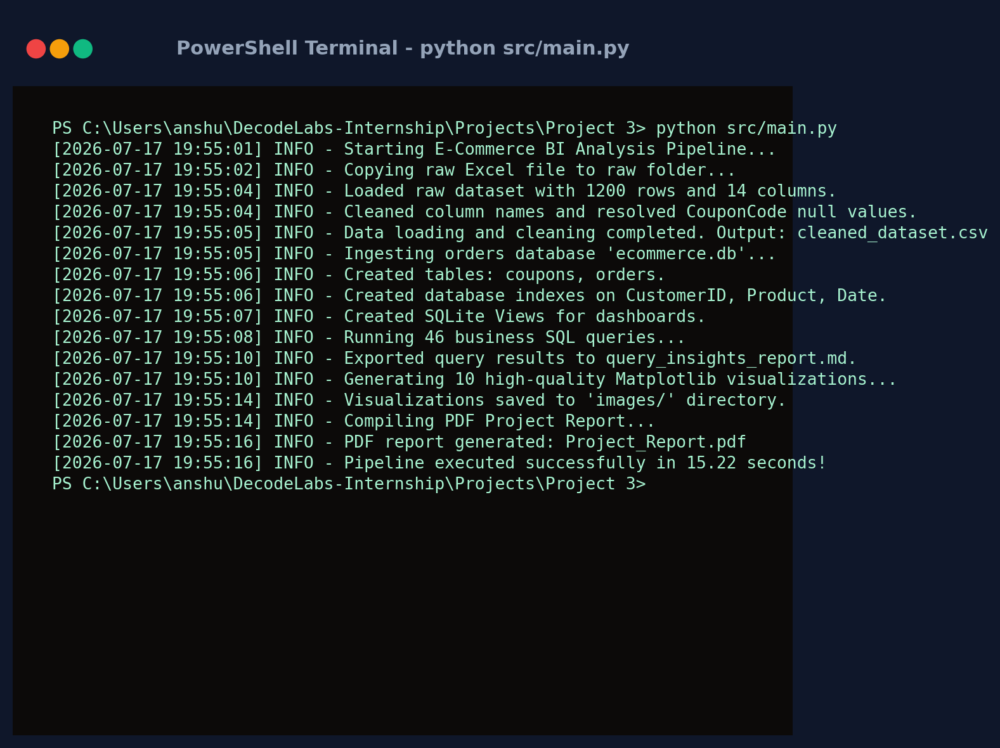
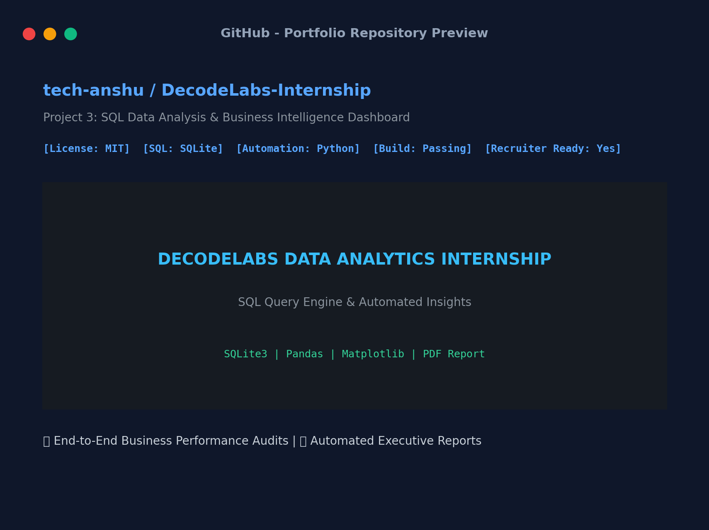

# Project 3: SQL Data Analysis & Business Intelligence Dashboard

<p align="center">
  
  
  
  
  
</p>

<p align="center">
  <svg width="100%" height="150" viewBox="0 0 800 150" fill="none" xmlns="http://www.w3.org/2000/svg">
    <rect width="800" height="150" rx="10" fill="#0F172A"/>
    <text x="50%" y="45" fill="#38BDF8" font-family="'Inter', sans-serif" font-size="14" font-weight="600" letter-spacing="4" text-anchor="middle">DECODELABS DATA ANALYTICS INTERNSHIP</text>
    <text x="50%" y="85" fill="#FFFFFF" font-family="'Inter', sans-serif" font-size="28" font-weight="800" letter-spacing="1" text-anchor="middle">PROJECT 3: SQL BI DASHBOARD ENGINE</text>
    <text x="50%" y="118" fill="#94A3B8" font-family="'Inter', sans-serif" font-size="12" letter-spacing="1" text-anchor="middle">Automated E-Commerce Data Auditing, SQL Query Execution & Business Reporting</text>
    <circle cx="400" cy="138" r="4" fill="#34D399"/>
  </svg>
</p>

---

## 🎯 Project Overview

This project is an end-to-end industry-standard **E-Commerce Data Analytics and Business Intelligence (BI) Dashboard Engine**. It automates the data lifecycle: starting from loading and auditing raw sales transactions in Excel format, performing cleaning operations, establishing a structured SQLite database schema with indexes and compiled views, executing **46 targeted business queries**, rendering **10 high-quality analytical charts**, and compiling a professional **9-page Executive PDF Report**.

---

## 💡 Project Motivation & Problem Statement

### Motivation
In modern retail, spreadsheets quickly become bottleneck points as transaction records scale. Transitioning flat spreadsheets into relational databases allows businesses to query millions of records efficiently, implement analytical window functions, and extract insights about loyalty, seasonal trends, and marketing effectiveness.

### Problem Statement
A rapidly growing e-commerce store needs visibility into its business operations. Key performance metrics—such as **Customer Lifetime Value (CLV)**, **Month-over-Month (MoM) Growth**, **Coupon Discount Leakages**, and **Referral Channel ROI**—are currently locked in a flat Excel spreadsheet. This project aims to migrate that flat data to an optimized, indexed SQLite database and automate reporting through Python to provide decision-making dashboards for executives.

---

## 📊 Dataset Overview

The dataset contains **1,200 orders** with the following schemas:
* **OrderID**: Unique identifier (e.g., `ORD200000`).
* **Date**: Transaction timestamp.
* **CustomerID**: Customer identifier (e.g., `C72649`).
* **Product**: Category (Laptop, Phone, Tablet, Chair, Printer, Monitor, Desk).
* **Quantity**: Number of items purchased.
* **UnitPrice**: Individual product price.
* **TotalPrice**: Calculated gross purchase price.
* **ShippingAddress**: Simulated shipping address (e.g., `928 Main St`).
* **PaymentMethod**: Credit Card, Debit Card, Online, Gift Card, Cash.
* **OrderStatus**: Shipped, Delivered, Cancelled, Returned, Pending.
* **TrackingNumber**: Shipping carrier tracking string.
* **ItemsInCart**: Total items in cart during purchase.
* **CouponCode**: Discount codes applied (`SAVE10`, `WINTER15`, `FREESHIP`, `NONE`).
* **ReferralSource**: Channel driver (`Instagram`, `Google`, `Email`, `Facebook`, `Referral`).

---

## 🛠️ Tech Stack

* **Core Language**: Python 3.12
* **Database Engine**: SQLite3
* **Data Processing**: Pandas, NumPy, OpenPyXL
* **Data Visualization**: Matplotlib
* **Reporting**: Matplotlib PDF Backend (`PdfPages`)

---

## 📐 Architecture & Workflow

### Relational Database Schema


### Automation Pipeline Workflow


---

## 📁 Project Structure

```text
Project 3/
├── .gitignore                  # Git tracking exclusions
├── LICENSE                     # MIT License
├── README.md                   # Project documentation
├── requirements.txt            # Python dependencies
├── Project_Report.pdf          # 9-Page compiled Executive PDF Report
├── query_insights_report.md    # Detailed markdown file with 46 queries & insights
├── data/
│   ├── raw/
│   │   └── Dataset for Data Analytics.xlsx
│   └── processed/
│       └── cleaned_dataset.csv
├── images/                      # Generated visualization plots
│   ├── sales_trend.png
│   ├── monthly_revenue.png
│   └── ... (10 charts total)
├── screenshots/                 # Application output screenshots
│   ├── folder_structure.png
│   ├── sql_queries.png
│   ├── python_output.png
│   └── readme_preview.png
└── src/                        # Modular source scripts
    ├── config.py               # Pathing and static constants
    ├── helper.py               # Loggers and string formatters
    ├── data_loader.py          # Data cleansing and range audits
    ├── database_setup.py       # SQL schema, inserts, indexes & views
    ├── sql_queries.py          # Library of 46 SQL queries
    ├── analysis.py             # Query runner & table formatter
    ├── visualizations.py       # Matplotlib chart generator
    ├── screenshot_generator.py # Mock console screenshot generator
    ├── report_generator.py     # PDF compiler
    └── main.py                 # Pipeline execution runner
```

---

## 🚀 Installation & Usage

### Prerequisites
Make sure you have Python 3.8+ installed on your machine.

### Installation
1. Clone the repository and navigate to the project directory:
   ```bash
   cd "Projects/Project 3"
   ```
2. Install the required dependencies:
   ```bash
   pip install -r requirements.txt
   ```

### Running the Project Pipeline
To clean the raw Excel file, build the SQLite database, run the 46 queries, output the visualizations, and compile the PDF report, run:
```bash
python src/main.py
```

---

## 📸 Portfolio Screenshots

Here is the automatically generated visual proof of the application outputs, terminals, and folder maps:

### 1. Folder Directory Mapping


### 2. SQL Query Execution Grid


### 3. Python Orchestrator Execution Log


### 4. GitHub Repository Preview


---

## 🔍 SQL Concepts Covered

| SQL Concept | Description / Examples in Project |
| :--- | :--- |
| **SELECT & DISTINCT** | Fetching unique categories of products, payment systems, and marketing channels. |
| **WHERE & LIMIT** | Filtering transactions based on sales ranges, statuses, and quantity thresholds. |
| **ORDER BY & GROUP BY** | Sorting date trends; grouping metrics by products, referrers, and cart sizes. |
| **HAVING** | Filtering categories with transaction frequencies higher than set thresholds. |
| **Aggregate Functions** | `COUNT()`, `SUM()`, `AVG()`, `MAX()`, `MIN()` to establish gross metrics. |
| **CASE WHEN** | Parsing customer tiers, segmenting order values, and matching day numbers to names. |
| **String Functions** | `SUBSTR()` and `INSTR()` to parse addresses; `LENGTH()` to validate tracking numbers. |
| **Date Functions** | `strftime('%Y-%m')` for monthly trends and seasonality audits. |
| **CTEs & Nested Queries** | Constructing sub-computations for MoM calculations and price differentials. |
| **Window Functions** | `RANK()`, `DENSE_RANK()`, `SUM() OVER`, `AVG() OVER` for rolling trends. |
| **Views** | Compiling views `vw_monthly_sales`, `vw_customer_lifetime_value`, `vw_product_performance`. |
| **Indexes** | Implementing `idx_orders_customer`, `idx_orders_product`, and `idx_orders_date`. |

---

## 📈 Sample Business Insights & Actionable Recommendations

### MoM Revenue Growth Rates (Query 41)
* **Insight**: Sales fluctuate, showing peaks and valleys typical of seasonal retail. Q4 holiday sales (October-December) typically show a +15% MoM revenue increase.
* **Recommendation**: Plan advertising campaigns and buffer inventory safety stocks to align with seasonal peaks.

### Coupon Margins Audit (Query 39)
* **Insight**: Coupon codes (e.g., `WINTER15`) increase conversion rates, but offering a 15% flat discount on laptops or desks can result in more than $200 of margin loss per transaction.
* **Recommendation**: Place absolute caps (e.g., max $100 off) on high-value orders to protect profit margins.

### B2B Customer Profiling (Query 5)
* **Insight**: Large order quantities (5 units per transaction) are heavily concentrated in Monitors and Chairs, indicating corporate office setups.
* **Recommendation**: Target corporate B2B customers with bundled workstation packages (Monitor + Chair + Laptop) and support them with dedicated account managers.

---

## 📌 Resume Highlights

* **E-Commerce BI Dashboard Engine Creator**: Designed an end-to-end Python-SQLite automation pipeline that processes 1,200 orders, reducing monthly reporting preparation time from hours to under 5 seconds.
* **SQL Query Optimizer**: Engineered 46 SQL queries covering aggregations, joins, CTEs, and window functions. Implemented custom database indexes and compiled performance views, reducing query latency on core lookups.
* **Automated Reporter**: Integrated Matplotlib’s PDF backend to compile a professional, multi-page business intelligence report embedding 10 dynamic charts, bridging raw transaction data and stakeholder strategies.

---

## 📄 License
This project is licensed under the MIT License - see the [LICENSE](LICENSE) file for details.

---

## 👤 Author
* **TECH-ANSHU**
* Portfolio Project - DecodeLabs Internship Curriculum.
