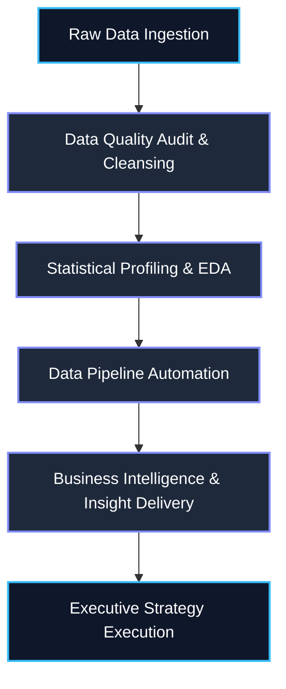

# DecodeLabs Data Analytics Internship

<p align="center">
  <svg width="100%" height="150" viewBox="0 0 800 150" fill="none" xmlns="http://www.w3.org/2000/svg">
    <rect width="800" height="150" rx="12" fill="url(#paint0_linear)"/>
    <defs>
      <linearGradient id="paint0_linear" x1="0" y1="0" x2="800" y2="150" gradientUnits="userSpaceOnUse">
        <stop stop-color="#0F172A"/> <!-- Slate-900 -->
        <stop offset="0.5" stop-color="#1E293B"/> <!-- Slate-800 -->
        <stop offset="1" stop-color="#0F172A"/> <!-- Slate-900 -->
      </linearGradient>
      <linearGradient id="text_gradient" x1="0" y1="0" x2="800" y2="0" gradientUnits="userSpaceOnUse">
        <stop stop-color="#38BDF8"/> <!-- Sky-400 -->
        <stop offset="1" stop-color="#818CF8"/> <!-- Indigo-400 -->
      </linearGradient>
    </defs>
    <!-- Subtitle/Context -->
    <text x="50%" y="45" fill="#94A3B8" font-family="'Inter', sans-serif" font-size="14" font-weight="600" letter-spacing="4" text-anchor="middle">DECODELABS DATA ANALYTICS</text>
    <!-- Title -->
    <text x="50%" y="90" fill="url(#text_gradient)" font-family="'Inter', sans-serif" font-size="34" font-weight="800" letter-spacing="2" text-anchor="middle">INTERNSHIP PORTFOLIO</text>
    <!-- Frame decoration -->
    <line x1="250" y1="115" x2="550" y2="115" stroke="#334155" stroke-width="2"/>
    <circle cx="400" cy="115" r="4" fill="#38BDF8"/>
  </svg>
</p>

<p align="center">
  <a href="https://git.io/typing-svg">
    
  </a>
</p>

---

## 🌟 Overview

Welcome to my portfolio repository for the **DecodeLabs Data Analytics Internship**. This space showcases a structured collection of real-world analytics projects solved during my internship. The curriculum focuses on building robust data pipelines, executing meticulous quality audits, generating exploratory insights, and communicating actionable business strategies to executive stakeholders.

The internship is structured around **exactly four industry-modeled projects**, starting from raw data preparation and scaling to advanced exploratory analysis and business intelligence.

---

## ⚙️ Repository Architecture

This repository is built for clean maintainability, absolute transparency, and recruiter accessibility. Every project is isolated in its own self-contained directory containing its documentation, data folders, scripts, and Jupyter walk-throughs.

```text
DecodeLabs-Internship/
├── README.md                           # Main landing page & internship overview
├── LICENSE                             # MIT License
├── .gitignore                          # Global python/Jupyter ignore file
├── Projects/
│   ├── Project 1/                      # E-Commerce Data Quality Audit & EDA (Completed)
│   │   ├── README.md                   # Independent Project 1 documentation
│   │   ├── data/                       # Subfolder for raw and processed datasets
│   │   ├── src/                        # Python modules (ETL, Validation, EDA)
│   │   ├── notebook/                   # Interactive Jupyter Notebook walkthrough
│   │   ├── images/                     # Output visualizations and plots
│   │   └── requirements.txt            # Project-specific Python dependencies
│   ├── Project 2/                      # Upcoming Project Placeholder
│   │   └── README.md
│   ├── Project 3/                      # Upcoming Project Placeholder
│   │   └── README.md
│   └── Project 4/                      # Upcoming Project Placeholder
│       └── README.md
├── Assets/                             # Repository branding and assets
│   ├── banner/
│   ├── logo/
│   ├── screenshots/
│   └── icons/
└── Resources/                          # Administrative files & credentials
    └── Internship-Certificate/         # DecodeLabs internship verification docs
```

---

## 🚀 Project Navigation

Below is the master navigation index. Each project folder contains its own independent `README.md` file featuring setup instructions, data auditing rules, interactive code documentation, and detailed business recommendations.

| Project | Project Title & Objective | Description | Tech Stack | Status | Access |
| :---: | :--- | :--- | :--- | :---: | :---: |
| **01** | **E-Commerce Data Quality Audit & EDA** | Auditing e-commerce financial records to correct calculation bugs (discount leakage) and analyzing acquisition/revenue trends. |    | `Completed` | [**View Project 📂**](./Projects/Project%201) |
| **02** | **Project 2 (Coming Soon)** | Upcoming data analytics project focused on advanced business metrics. |  | `In Queue` | [**Coming Soon 🔒**](./Projects/Project%202) |
| **03** | **Project 3 (Coming Soon)** | Upcoming analytical case study modeled on product/logistics optimization. |  | `In Queue` | [**Coming Soon 🔒**](./Projects/Project%203) |
| **04** | **Project 4 (Coming Soon)** | Final internship project focused on predictive modeling or KPI dashboards. |  | `In Queue` | [**Coming Soon 🔒**](./Projects/Project%204) |

---

## 🛠️ Technology Stack

Below is the foundational toolkit leveraged throughout the internship to build end-to-end data analytics solutions.

* **Programming & Core Analytics**:
  [](https://www.python.org/)
  [](https://pandas.pydata.org/)
  [](https://numpy.org/)
  [](https://matplotlib.org/)

* **Development Environments**:
  [](https://jupyter.org/)
  [](https://code.visualstudio.com/)

* **Version Control & Documentation**:
  [](https://git-scm.com/)
  [](https://github.com/)

* **Office & Stakeholder Delivery**:
  [](https://www.microsoft.com/excel)

---

## 📈 Internship Objectives & Learning Goals

The DecodeLabs Internship simulates the roles and responsibilities of an embedded Data Analyst. Key areas of growth and execution include:



### 🧠 Skills Developed
* **Data Quality Engineering**: Constructing programmatic assertions to check for value limits, type mismatches, calculation leaks, and logistical integrity violations.
* **Exploratory Analytics**: Mining multivariate relations (e.g., revenue vs. marketing channels, seasonality vs. volumes).
* **Software Engineering Practices**: Building modular python scripts (`src/`), tracking environments (`requirements.txt`), and structuring repositories to enterprise levels.
* **Executive Communication**: Structuring raw technical observations into formatted business proposals detailing revenue, margin impact, and channel ROI.

---

## 📅 Timeline & Milestones

* **Milestone 1**: Project 1 (E-Commerce Quality Audit & EDA) — **Completed** (July 2026)
* **Milestone 2**: Project 2 (To Be Announced) — **In Queue**
* **Milestone 3**: Project 3 (To Be Announced) — **In Queue**
* **Milestone 4**: Project 4 (Final Case Study & Certification) — **In Queue**

---

## 📬 Contact & Networks

Let's connect! I'm passionate about Data Analytics, Python, and building real-world solutions through the DecodeLabs Data Analytics Internship. Feel free to connect, collaborate, or explore my work.

<p align="center">

<a href="https://github.com/TECH-ANSHU">

</a>

<a href="https://www.linkedin.com/in/anshumanpolai-cyber/">

</a>

<a href="mailto:anshumanpolai@gmail.com">

</a>

</p>

---

<p align="center">
  <sub>Project designed and maintained under the DecodeLabs Data Analyst Internship Curriculum. © 2026 TECH-ANSHU. License: MIT.</sub>
</p>
